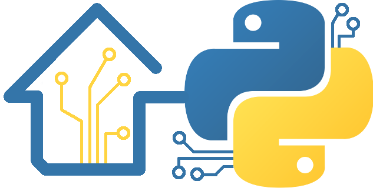

# La Maison Pythonic

La Maison Pythonic, c'est un projet didactique accompagnant __le livre "(TODO)"__ et dont le but est 
* d'aborder la capture de données avec des objets Internet (ESP8266 sous MicroPython),  
* la transmission télémétrique avec Mosquitto MQTT, 
* le stockage en base de données (SQLite3 et Python), 
* le rendu sous forme de pages HTMLs avec Flask (Python). 

Le tout en utilisant un Raspberry-Pi comme élément central tout en respectant les limites de ses ressources.

# A propos du Livre 

Capturez des données télémétriques et réaliser des tableaux de bord WEB
* __Rasperry-Pi__ avec __MQTT__, __Flask__, __SQLite__, __Python__
* __ESP8266__ avec __MicroPython__, __montages__
* Pour les Makers, les développeurs, les curieux en électronique

Ce livre s'adresse à toute personne qui souhaite découvrir comment __capturer des données télémétriques__ d'une maison (température, humidité, pression atmosphérique, luminosité) et les présenter dans une interface web sous forme de __tableaux de bord__. L'auteur s'appuie pour cela sur les possibilités offertes par le langage __Python__, le nano-ordinateur __Raspberry Pi__ et le framework __Flask__. Bien qu'appliqué au Raspberry Pi, le contenu du livre est suffisamment universel pour être exploité sur d'autres plateformes telles que des ordinateurs.

Pour tirer le meilleur profit de la lecture de ce livre, des notions de __programmation orientée objet__ et  quelques rudiments sur le langage Python et en __électronique__ sont nécessaires. Une première expérience avec le Raspberry Pi et est également souhaitée.

Les points technologiques du livre sont isolés et vulgarisés avant d'être intégrés dans un projet global qui sert de fil conducteur à la prise en main et l'exploitation des différentes technologies étudiées. L'auteur commence par présenter la __collecte de données__ à l'aide de composants basés sur un __microcontrôleur ESP8266__ programmé avec __MicroPython__. Il détaille ensuite la centralisation de ces données à l'aide d'un __broker MQTT__ fonctionnant sur un __Raspberry Pi__. Dans la suite du livre, le lecteur découvre comment une __base de données SQLite 3__ permet d'offrir un __stockage persistant__ des données et comment elle peut être exploitée par une __application Flask__ pour produire des __tableaux de bord sur mesure__.

À l'issue de ce livre, le lecteur disposera de bases solides pour créer sereinement une grande variété de solutions, plus ou moins sophistiquées, en fonction de ses besoins.

__Plus d'information sur le livre__ sur [le site de l'éditeur (Editions ENI)](https://www.editions-eni.fr/livre/python-raspberry-pi-et-flask-capturez-des-donnees-telemetriques-et-realisez-des-tableaux-de-bord-web-9782409016318)

__Le code source de ce GitHub correspondant au livre__ est disponible dans l'archive [la-maison-pythonic-(master-livre).zip](https://github.com/mchobby/la-maison-pythonic/raw/master/res/la-maison-pythonic-(master-livre).zip) . 

# Installation 

Voir [les notes d'installation rapide](res/install-rapide.md)

# Matériel 
Vous trouverez facilement nécessaire chez les distributeurs Adafruit. Voici une proposition de lien:
* [Feather ESP8266 Huzzah](https://shop.mchobby.be/feather/846-feather-huzzah-avec-esp8266-3232100008465-adafruit.html) - plateforme certifiée distribuée dans le monde entier! 
* LED et Bouton, résistance pull-up et déparasitage logiciel
* [Potentiomètre](https://shop.mchobby.be/autres/33-potentiometre-breadboard-10k-3232100000339.html) sur l'entrée analogique
* [MCP23017](https://shop.mchobby.be/ci/218-mcp23017-extension-16-entree-sortie-i2c-3232100002180.html) pour ajouter des entrées sorties
* [ADS1115](https://shop.mchobby.be/breakout/362-ads1115-convertisseur-adc-16bits-i2c-3232100003620-adafruit.html) pour ajouter des entrées analogiques
* [TMP36](https://shop.mchobby.be/senseur-divers/59-senseur-temperature-tmp36-3232100000599.html) pour mesurer la température (en analogique)
* [DS18B20](https://shop.mchobby.be/senseur-divers/259-senseur-temperature-ds12b20-extra-3232100002593.html) (et [DS18B20 water-proof](https://shop.mchobby.be/senseur-divers/151-senseur-temperature-ds18b20-etanche-extra-3232100001510.html) ) mesure de température (numérique, OneWire)
* [Senseur PIR](https://shop.mchobby.be/mouvement/61-senseur-proximite-mouvement-infrarouge-3232100000612.html) pour détecter les mouvements à proximité
* [Contact magnétique](https://shop.mchobby.be/proximite/911-contact-porte-magnetique-3232100009110.html) pour détecter l'ouverture d'une porte
* [DHT11](https://shop.mchobby.be/senseurs-prototypage/708-dht11-senseur-humidite-temperature--3232100007086-adafruit.html) (ou [DHT22](https://shop.mchobby.be/senseurs-prototypage/214-dht22-am2302-senseur-humidite-temperature--3232100002142-adafruit.html) ) pour la mesure d'humidité
* [AM2315](https://shop.mchobby.be/senseur-divers/932-am2315-senseur-de-temperature-et-humidite-sous-boitier-3232100009325.html) senseur d'humidité et T° weather-proof.
* [Senseur à Effet Hall](https://shop.mchobby.be/proximite/86-senseur-effet-hall-us5881lua-extra-3232100000865.html) pour la détection de présence de champs magnétique.
* [TSL2561](https://shop.mchobby.be/senseur-divers/238-senseur-lux-luminosite-lumiere-digital-3232100002388-adafruit.html) pour la mesure de luminosité
* [BME280](https://shop.mchobby.be/breakout/684-bme280-sens-temperature-humidite-pression--3232100006843-adafruit.html) pour la mesure de pression Atmosphérique, Température, Humidité
* [BMP280](https://shop.mchobby.be/senseurs-prototypage/1118-bmp280-senseur-de-pression-barometrique-temperature-altitude-33-et-5v-3232100011182-adafruit.html) pour la mesure de pression Atmosphérique et T°
* RELAIS [module Relais](https://shop.mchobby.be/breakout/107-module-relais-3232100001077-pololu.html) ou [Bi-Relais](https://shop.mchobby.be/breakout/507-module-deux-relais-3232100005075-pololu.html) pour commander des appareils.
* [PHOTO-RESISTANCE](https://shop.mchobby.be/senseur-divers/58-photo-resistance-3232100000582.html)

# Le projet en quelques images

Les deux images suivantes présentent les éléments principaux du projet. Tous les détails sont disponibles dans Livre.

Les tableaux de bords (projet "Dashboard", Python + Flask + Materialize)

# Annexes
* [Installation Rapide](res/install-rapide.md)
* [Mode Hors Ligne](res/mode-hors-ligne.md) 
* [MQTT Track](res/mqtt_track.sh) - suivre les messages sur le broker MQTT.

