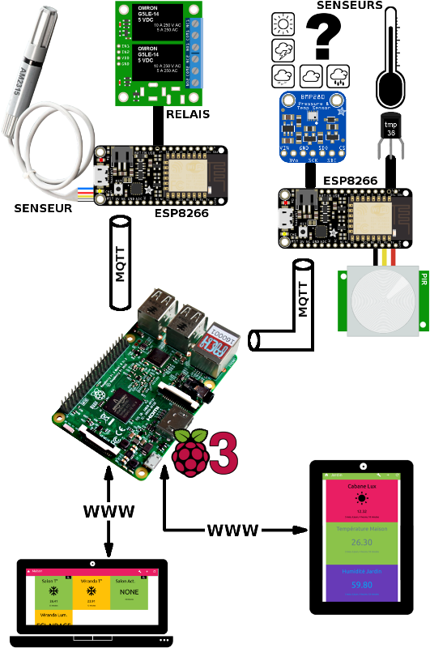
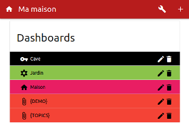
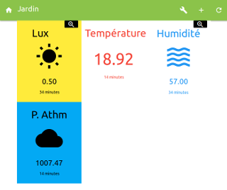
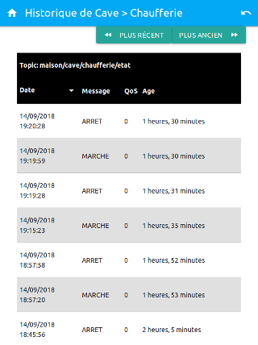

# La Maison Pythonic

La Maison Pythonic, c'est un projet didactique accompagnant __le livre "(TODO)"__ et dont le but est 
* d'aborder la capture de données avec des objets Internet (ESP8266 sous MicroPython),  
* la transmission télémétrique avec Mosquitto MQTT, 
* le stockage en base de données (SQLite3 et Python), 
* le rendu sous forme de pages HTMLs avec Flask (Python). 

Le tout en utilisant un Raspberry-Pi comme élément central tout en respectant les limites de ses ressources.

# A propos du Livre 

(TODO)

Cet ouvrage vise l'apprentissage de différentes bases technologiques par l'intermédiaire de la réalisation -étape par étape- d'un projet mené de bout en bout. 

La lecture des différents chapitres offrira de solides bases de connaissances et des outils pour aborder sereinement n'importe quel autre projet exploitant ces technologies.

Le cas échéant, ce savoir permettra de comprendre ce qui se passe sous le capot de solutions « clé sur porte ». 

__Le code source de ce GitHub correspondant au livre__ est disponible dans l'archive [la-maison-pythonic-(master-livre).zip](res/la-maison-pythonic-(master-livre).zip) . 

# Le projet en quelques images

Les deux images suivantes présentent les éléments principaux du projet. Tous les détails sont disponibles dans Livre.

Les tableaux de bords (projet "Dashboard", Python + Flask + Materialize)

